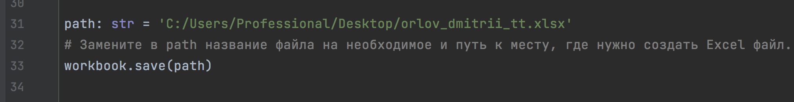
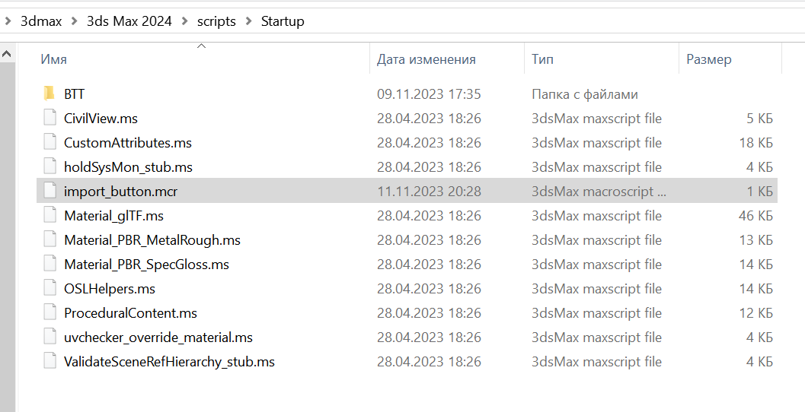
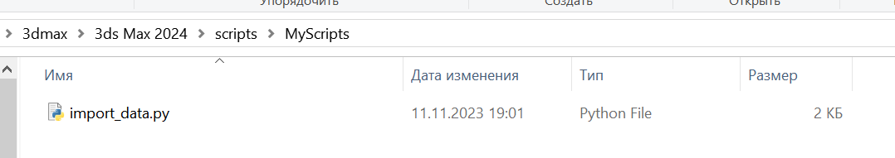
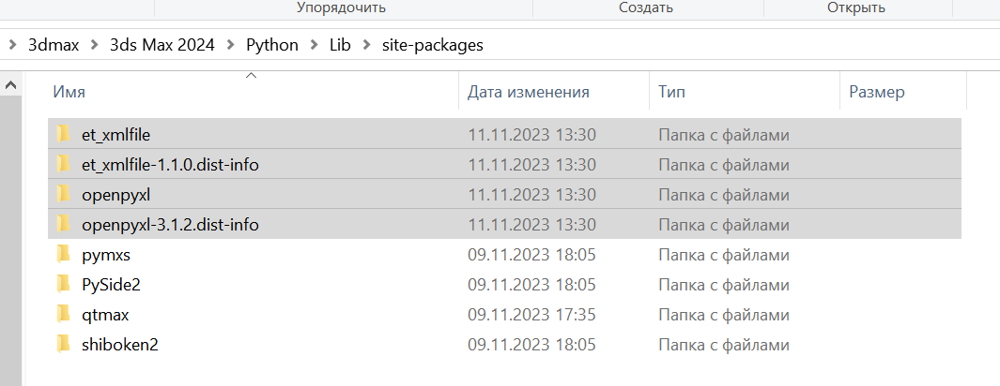
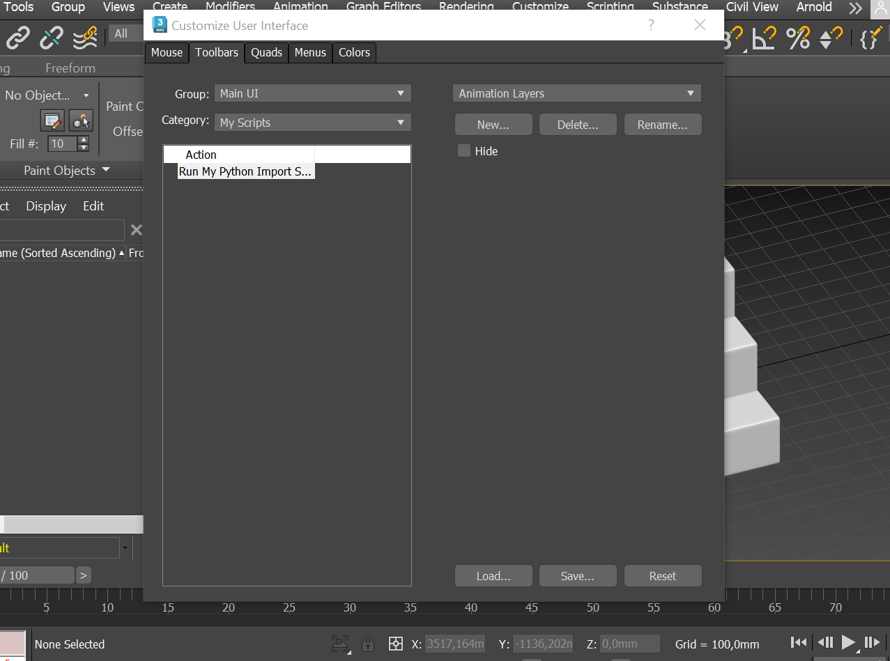
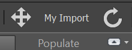
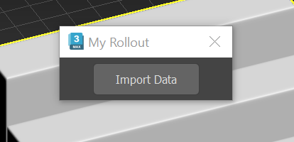
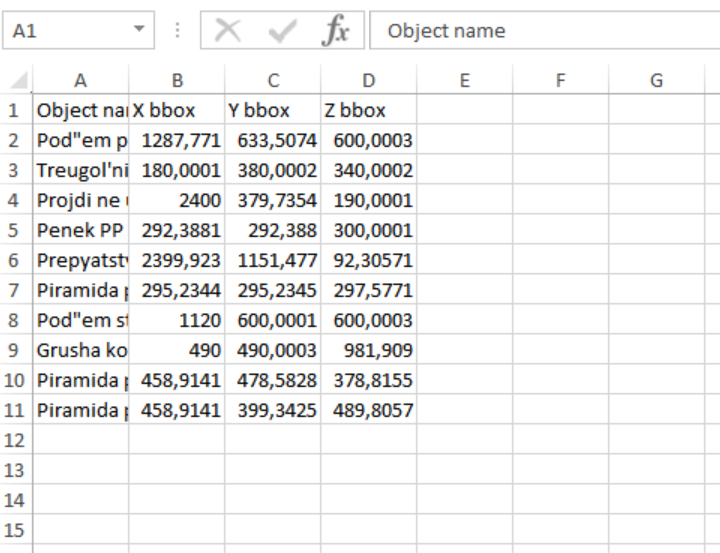

# Кастомная Import кнопка для 3ds Max 

Мини проект представляет из себя макрос и Python скрипт для 3ds Max, позволяющие создать кастомную кнопку. С помощью нее можно легко импортировать и записать в Excel файл названия и X, Y, Z габариты ограничивающего параллелепипеда (Bounding box) всех фигур, находящихся на активной сцене. 

## Инструкция по настройке

1. В файле "import_data.py" в переменной "path" укажите путь до желаемого места создания Excel файла и название самого
   файла.
   

2. Файл "import_button.mcr" с макросом для создания кастомной кнопки необходимо разместить в стандартной папке "Startup"
   внутри папки с 3ds Max.
   

3. В стандартной папке "scripts" внутри папки с 3ds Max необходимо создать папку "MyScripts" (если она там еще не
   существует). В нее необходимо поместить файл "import_data.py" со скриптом для импорта необходимых данных и записи их
   в Excel.
   

4. Для выполнения скрипта на Python необходимо установить библиотеку openpyxl 3.1.2 . Я использовал встроенный Python
   версии 3.10.8, поставляемый вместе с 3ds Max 2024 по умолчанию, и загружал библиотеку в него. Но есть возможность
   использовать и сторонний Python. Тогда нужно установить соответствующую библиотеку в него.
   

5. Далее необходимо настроить кнопку. С помощью кнопки "Customize" открыть меню "Customize User Interface" и в
   закладке "Toolbars" выбрать категорию "My Scripts". Выбрать кнопку и перетащить в любое доступное и удобное место.
   Перезагрузить 3ds Max.

5.1 

5.2

6. Кнопка готова к использованию. Откройте необходимую сцену с фигурами, нажмите кнопку, подтвердите импорт в
   появившемся rollout'е.

7. Готово! По адресу, который вы указали в переменной "path" в файле "import_data.py" появится Excel файл с заданным
   названием. В нем будут данные по каждой геометрической фигуре на сцене (название объекта, X, Y и Z габариты bbox
   объекта).
   

   
#### Авторство: Дмитрий Орлов